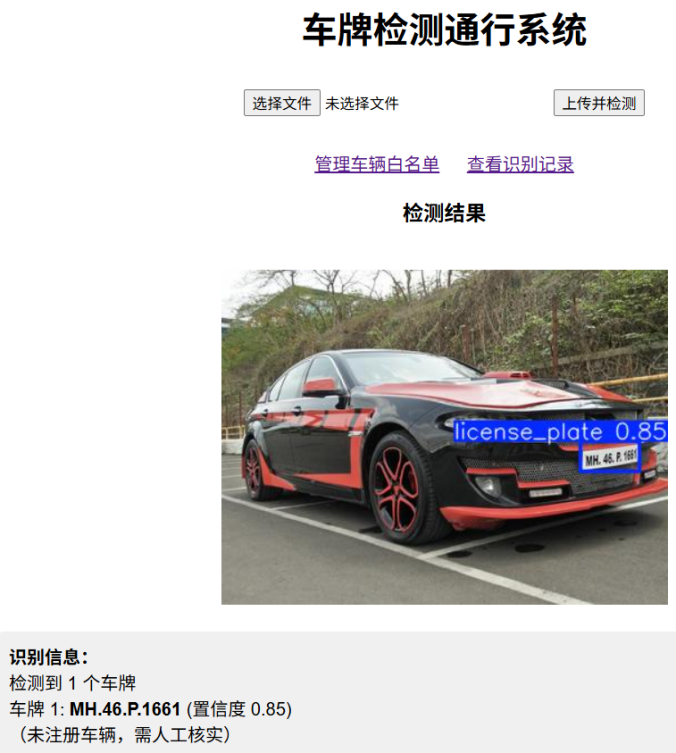
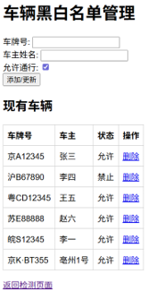
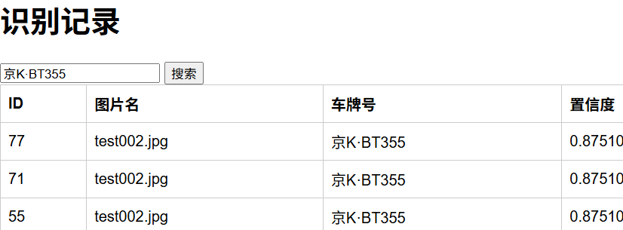

# 车牌检测识别及通行管理系统

基于 YOLOv5 与 PaddleOCR 的车牌检测、识别与通行管理 Web 系统，实现图片上传、自动识别、黑白名单通行判断、识别记录存储与查询等完整功能。


---

## 📌 项目简介

针对当前车牌识别系统功能单一、数据管理薄弱、依赖云端 API 存在隐私风险等问题，设计并实现了一套全本地化的车牌检测识别及通行管理系统。系统采用 YOLOv5s 完成车牌检测，PaddleOCR 完成字符识别，基于 Flask 框架搭建 Web 管理平台，使用 SQLite 数据库存储识别记录和车辆黑白名单信息。

经过 30 轮训练，模型在验证集上的 mAP@0.5 达到 **91.1%**，单张图片处理时间约 **0.83 秒**。

---

## ✨ 功能特性

| 模块 | 功能 |
|------|------|
| **车牌检测** | YOLOv5s 车牌定位，NMS 后处理，检测框绘制与 base64 输出 |
| **车牌识别** | PaddleOCR 字符识别，支持中文车牌，异常处理（识别失败 / OCR 出错） |
| **通行管理** | 黑白名单增删改查、通行判断（允许 / 禁止 / 未注册）、识别记录自动存储 |
| **历史查询** | 按车牌号模糊搜索历史识别记录 |
| **Web 交互** | Flask 构建主页、管理页、记录页，HTML/CSS 内嵌模板 |

---

## 📸 系统截图

### 系统主界面


*车牌检测系统主界面，支持图片上传与检测*

### 检测结果示例



*车牌检测与识别结果展示，包含置信度信息*

### 管理页面



*车辆黑白名单管理页面，支持添加、删除、更新车辆信息*

### 识别记录



*历史识别记录查询页面，支持车牌号模糊搜索*


---

## 🛠️ 技术栈

| 层级 | 技术 |
|------|------|
| 深度学习框架 | PyTorch 2.8.0 |
| 目标检测 | YOLOv5 |
| OCR 识别 | PaddleOCR 2.7.3 |
| Web 框架 | Flask 2.0+ |
| 数据库 | SQLite 3 |
| 图像处理 | OpenCV 4.5.5, Pillow |
| 数值计算 | NumPy 1.24.3 |

---

## 📊 数据集与模型

- **数据来源**：Kaggle 公开车牌检测数据集（ANPR YOLO 格式）
- **数据规模**：658 张有效图像（训练集 525 张，验证集 133 张）
- **模型版本**：YOLOv5s
- **训练轮数**：30 轮
- **输入尺寸**：640 × 640
- **批量大小**：8
- **优化器**：SGD（初始学习率 0.01，动量 0.937）

**性能指标**：

| 指标 | 数值 |
|------|------|
| mAP@0.5 | **0.911** |
| Precision | **0.909** |
| Recall | **0.896** |

---

## 🚀 快速开始

### 1. 克隆项目

```bash
git clone https://github.com/kiym7/yolov5.git
cd yolov5
```

### 2. 创建虚拟环境

```bash
# 使用 Conda（推荐）
conda create -n yolov5 python=3.9
conda activate yolov5

# 或使用 venv
python -m venv venv
source venv/bin/activate  # Linux/Mac
venv\Scripts\activate     # Windows
```

### 3. 安装依赖

```bash
pip install -r requirements.txt

# 如需 GPU 加速（可选）
pip install torch torchvision torchaudio --index-url https://download.pytorch.org/whl/cu118
```

### 4. 启动 Web 服务

```bash
python app_flask.py
```

访问 `http://127.0.0.1:5000` 即可使用系统。

---

## 📁 项目结构

```
.
├── app_flask.py              # Flask 主程序
├── requirements.txt          # 项目依赖
├── license_plate.db          # SQLite 数据库（自动生成）
├── datasets/                 # 数据集目录
│   ├── images/               # 图片（train/val 子目录）
│   │   ├── train/            # 训练集图片
│   │   └── val/              # 验证集图片
│   ├── labels/               # YOLO 格式标签
│   │   ├── train/            # 训练集标签
│   │   └── val/              # 验证集标签
│   └── data.yaml             # 数据集配置文件
├── yolov5/                   # YOLOv5 源码
│   └── runs/train/           # 训练结果目录
│       ├── exp2/weights/     # 训练权重
│       ├── exp3/weights/     # 训练权重
│       └── exp42/weights/    # 训练权重（best.pt）
├── assets/                   # README 图片资源
│   ├── homepage.png          # 系统主界面截图
│   ├── result.png            # 检测结果示例
│   ├── admin.png             # 管理页面截图
│   ├── records.png           # 识别记录页面截图
│   └── architecture.png      # 系统架构图
└── test_output/              # 测试结果输出目录
```

---

## 🔮 优化方向

本项目后续可从以下方面进行优化：

### 1. 界面优化（优先级：高）

- **HTML 界面美化**：使用现代化 CSS 框架（如 Bootstrap 5、Tailwind CSS）替换当前内嵌样式，提升界面美观度与一致性
- **响应式设计**：适配不同屏幕尺寸（桌面、平板、手机），优化移动端访问体验
- **用户交互优化**：
  - 添加图片上传进度条与加载动画
  - 实现拖拽上传功能
  - 添加操作成功/失败的反馈提示（Toast 组件）
  - 支持图片预览与裁剪

### 2. 功能优化（优先级：中）

- **实时视频流识别**：支持摄像头实时捕获与识别，实现门禁场景实时监控
- **批量图片处理**：支持多张图片批量上传与识别，提升处理效率
- **导出功能**：支持将识别记录导出为 CSV、PDF 或 Excel 格式，便于数据分析与报告生成
- **API 接口封装**：提供 RESTful API 接口，支持第三方系统集成
- **车牌颜色识别**：增加车牌颜色分类功能（蓝牌、黄牌、绿牌等）

### 3. 性能优化（优先级：中）

- **模型推理加速**：
  - 使用 TensorRT 或 ONNX Runtime 加速推理
  - 尝试轻量化模型（YOLOv5n、YOLOv8n）降低部署门槛
- **数据库优化**：
  - 添加索引优化查询性能
  - 实现分页查询避免大数据集加载延迟
- **异步处理**：使用异步任务队列（如 Celery）处理耗时识别任务，避免阻塞 Web 服务

### 4. 安全优化（优先级：中）

- **用户认证**：实现用户登录与权限管理（管理员/普通用户角色）
- **数据加密**：对敏感信息（车主姓名、车牌号）进行加密存储
- **API 安全**：添加 JWT 认证、请求频率限制防止恶意调用
- **日志审计**：记录关键操作日志，便于安全审计与问题追溯

### 5. 部署优化（优先级：低）

- **容器化部署**：提供 Dockerfile 与 Docker Compose 配置，简化部署流程
- **云端部署指南**：编写 AWS、阿里云等云平台部署教程
- **自动备份**：实现数据库自动备份与恢复机制

---

## 📄 许可证

本项目采用 MIT 许可证，详见 [LICENSE](LICENSE) 文件。

---

## 🙏 致谢

本项目基于以下开源项目构建：

- [YOLOv5](https://github.com/ultralytics/yolov5) - 目标检测框架
- [PaddleOCR](https://github.com/PaddlePaddle/PaddleOCR) - OCR 识别引擎
- [Flask](https://flask.palletsprojects.com/) - Web 框架

---

## 📧 联系方式

如有问题或建议，欢迎通过以下方式联系：

- 提交 Issue：[GitHub Issues](https://github.com/kiym7/yolov5/issues)
- 项目仓库：[https://github.com/kiym7/yolov5](https://github.com/kiym7/yolov5)